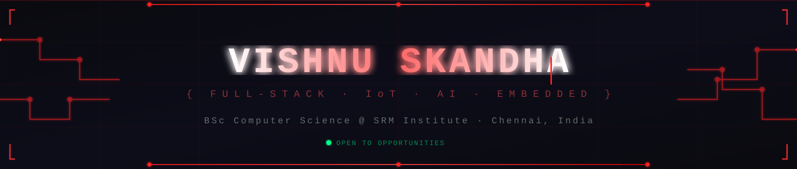

# Vishnu Skandha

**Full-Stack Developer · IoT Engineer · AI/ML Builder**

Chennai, India · BSc Computer Science, SRM Institute of Science and Technology

## About

I build systems that sit at the intersection of software, hardware, and AI — blockchain-anchored identity platforms, embedded sensor networks, and computer vision pipelines. Most of my work ships end-to-end: contract to frontend, sensor to dashboard, model to inference.

Currently building **CO-PE**, a psychometric career-assessment platform, in partnership with my father through our consulting practice. Currently exploring neuro-inspired navigation for embedded robotics and continuous AI/IoT monitoring for agriculture.

## Projects

### [TrustDegree](https://github.com/vishnuskandha/TrustDegree)
Decentralized academic credential verification. Institutions issue diplomas as soulbound (non-transferable) ERC-721 tokens; anyone verifies authenticity in seconds via QR scan — no registrar calls, no gatekeeping.

`Solidity` `Hardhat` `OpenZeppelin` `React` `TypeScript` `Node.js` `Express` `PostgreSQL`

Live: [trustdegree.vercel.app](https://trustdegree.vercel.app)

### [Arduino & Raspberry Pi Project Suite](https://github.com/vishnuskandha/arduino-rpi-projects)
Nineteen embedded systems projects, each with circuit diagrams and full documentation: automated fire detection with servo-controlled suppression, RFID-based access control, ultrasonic obstacle-avoidance robotics, MQTT sensor telemetry, ESP32 air-quality monitoring with a live web dashboard.

`Arduino` `ESP32` `Raspberry Pi` `Python` `MQTT` `C++`

### [BehaviourAI](https://github.com/vishnuskandha/Behaviour.ai)
Customer behavior analytics platform. Random Forest classification and K-Means clustering behind a Flask REST API — live prediction, on-demand model retraining, and aggregate trend reporting.

`Flask` `scikit-learn` `Python` `Gunicorn`

### [AirNav](https://github.com/vishnuskandha/AirNav)
Hands-free PC control via webcam-based hand-gesture recognition. Real-time MediaPipe landmark tracking mapped to cursor and system commands.

`Python` `MediaPipe` `OpenCV`

### [CodeGenome](https://github.com/vishnuskandha/CodeGenome)
Repository intelligence CLI. Analyzes git history for commit patterns and hotspots, scores code quality (documentation coverage, complexity, naming), scans dependencies for known CVEs, and maps findings to OWASP Top 10 categories.

`Python` `GitPython` `pylint` `radon`

<strong>More projects</strong>

 

**Full-Stack / Web**
- [LocalLM Chat](https://github.com/vishnuskandha/locallm-chat) — zero-build streaming chat UI for local LLMs via LM Studio

**IoT / Embedded** — all within the [Arduino & RPi Suite](https://github.com/vishnuskandha/arduino-rpi-projects)
- Fire detection & suppression · RFID access control · ESP32 air-quality monitor · MQTT temperature logger · weather station · Bluetooth-controlled robot

**Computer Vision**
- [LiveCam Detection](https://github.com/vishnuskandha/LiveCam_Dectection) — real-time YOLOv13 object detection, cross-platform

## Stack

| | |
|---|---|
| **Languages** | Python, JavaScript, TypeScript, C, C++, Java |
| **Frontend** | React, Next.js, Tailwind CSS |
| **Backend** | Node.js, Express, Flask |
| **Data** | PostgreSQL, MySQL |
| **AI/ML** | PyTorch, TensorFlow, OpenCV, YOLO, scikit-learn |
| **Embedded** | ESP32, Arduino, Raspberry Pi, MQTT, GPIO/I2C/SPI |
| **Blockchain** | Solidity, Hardhat, ERC-721, Polygon |
| **Infra** | Linux, Docker, Git, Vercel |

## GitHub Activity

Open to internships, collaborations, and full-time roles in AI, IoT, and full-stack engineering.

[LinkedIn](https://linkedin.com/in/vishnuskandha) · [Portfolio](https://vishnuskandha.qzz.io) · [Email](mailto:vishnu.skandha@gmail.com)

